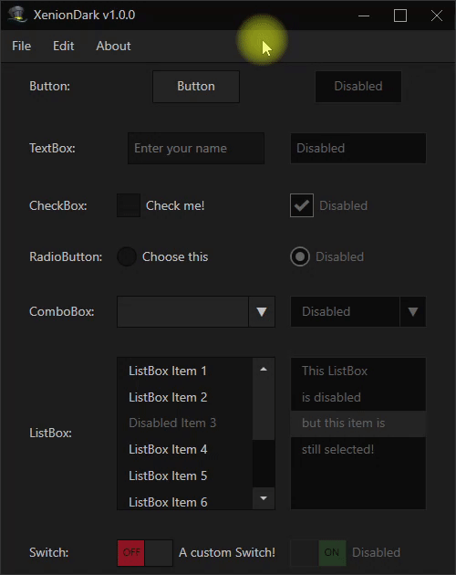
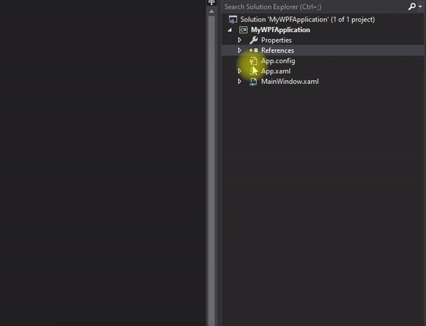
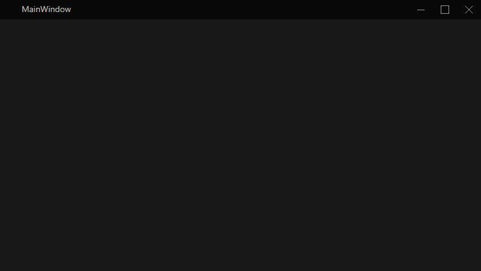

# XenionDark
A dark theme for WPF applications.

**Table of contents**
1. [Preview](#preview)
2. [How to install](#how-to-install)
3. [How to use](#how-to-use)
   1. [Main Window](#main-window)
   2. [Basic Controls](#basic-controls)
4. [Issues, bugs, suggestions](#issues-bugs-suggestions)


## Preview



## How to install

1. Download the latest release [here](https://github.com/wRadion/XenionDark/releases).
2. Add the reference to the dll in your projet:



3. Add the namespace reference in your xaml file:

```xml
  xmlns:xd="clr-namespace:XenionDark;assembly=XenionDark"
```

Example:
```xml
<Window x:Class="MyWPFApplication.MainWindow"
        xmlns="http://schemas.microsoft.com/winfx/2006/xaml/presentation"
        xmlns:x="http://schemas.microsoft.com/winfx/2006/xaml"
        xmlns:d="http://schemas.microsoft.com/expression/blend/2008"
        xmlns:mc="http://schemas.openxmlformats.org/markup-compatibility/2006"
        xmlns:local="clr-namespace:MyWPFApplication"
        xmlns:xd="clr-namespace:XenionDark;assembly=XenionDark"
        mc:Ignorable="d"
        Title="MainWindow" Height="450" Width="800">
  <Grid>
  <Grid>
</Window>
```

## How to use

### Main Window

To have the custom XenionDark window, your window has to inherit the `XenionDark.Window` class
instead of the default `System.Windows.Window`:

```csharp
// ...
// usings

namespace MyWPFApplication
{
    /// <summary>
    /// Interaction logic for MainWindow.xaml
    /// </summary>
    public partial class MainWindow : XenionDark.Window
    {
        public MainWindow()
        {
            InitializeComponent();
        }
    }
}
```

And you have to change the `Window` control to `xd:Window` in the .xaml file:

```xml
<xd:Window x:Class="MyWPFApplication.MainWindow"
        xmlns="http://schemas.microsoft.com/winfx/2006/xaml/presentation"
        xmlns:x="http://schemas.microsoft.com/winfx/2006/xaml"
        xmlns:d="http://schemas.microsoft.com/expression/blend/2008"
        xmlns:mc="http://schemas.openxmlformats.org/markup-compatibility/2006"
        xmlns:local="clr-namespace:MyWPFApplication"
        xmlns:xd="clr-namespace:XenionDark;assembly=XenionDark"
        mc:Ignorable="d"
        Title="MainWindow" Height="450" Width="800">

    <!-- content ... -->

</xd:Window>
```

Don't forget the namespace declaration!

```xml
  xmlns:xd="clr-namespace:XenionDark;assembly=XenionDark"
```

If you run your application, you should see this:



### Basic Controls

The current XenionDark version has the following controls implemented:
- `xd:Button`
- `xd:CheckBox`
- `xd:ComboBox`
  - `xd:ComboBoxItem`
- `xd:ContextMenu` and `xd.Menu`
  - `xd:MenuItem`
  - **Separator** is implemented but it's tricky to override, so you have to use
  an empty `xd:MenuItem` to display a separator: `<xd:MenuItem />`
- `xd:ListBox`
  - `xd:ListBoxItem`
- `xd:RadioButton`
- `xd:ScrollViewer`
  - `xd:ScrollBar`
- `xd:Switch`
    - A custom control that inherits `ToggleButton`. The **boolean value**
    is stored in the property `IsChecked` (like a `CheckBox` or `RadioButton`).
- `xd:TextBlock`
- `xd:TextBox`
    - A custom property `Placeholder` was added to display a text inside the
    box. It disappears when the TextBox has focus or when there's a text inside.
- `xd:Window`

All the custom controls inherit the basic Windows control. So you can
use any properties you want as if the control was the default one.

## Issues, bugs, suggestions

This project is at a very early development stage. If you have any questions, issues
or requests for this theme please feel free to create a Github issue or you
can contact me at **`wradion@gmail.com`**.
