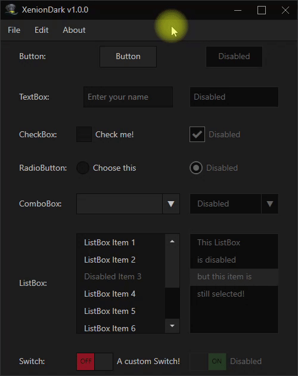

# XenionDark
A dark theme for WPF applications.

**Table of contents**
1. [Preview](#preview)
2. [How to Install/Setup](#how-to-installsetup)
3. [Basic Controls](#basic-controls)
4. [Controls TODO](#controls-todo)
5. [Issues, bugs, suggestions](#issues-bugs-suggestions)

## Preview

## How to install/setup

The tutorial is [on this Wiki page](https://github.com/wRadion/XenionDark/wiki/How-to-Install-Setup)

## Basic Controls

The current XenionDark version has the following controls implemented:
- [`xd:Button`](https://github.com/wRadion/XenionDark/wiki/Controls:-Button)
- [`xd:CheckBox`](https://github.com/wRadion/XenionDark/wiki/Controls:-CheckBox)
- [`xd:ComboBox`](https://github.com/wRadion/XenionDark/wiki/Controls:-ComboBox)
- [`xd:ContextMenu`](https://github.com/wRadion/XenionDark/wiki/Controls:-ContextMenu)
- [`xd:ListBox`](https://github.com/wRadion/XenionDark/wiki/Controls:-ListBox)
- [`xd:RadioButton`](https://github.com/wRadion/XenionDark/wiki/Controls:-RadioButton)
- [`xd:ScrollViewer`](https://github.com/wRadion/XenionDark/wiki/Controls:-ScrollViewer)
- [`xd:Switch`](https://github.com/wRadion/XenionDark/wiki/Controls:-Switch)
- [`xd:TextBlock`](https://github.com/wRadion/XenionDark/wiki/Controls:-TextBlock)
- [`xd:TextBox`](https://github.com/wRadion/XenionDark/wiki/Controls:-TextBox)
- [`xdw:Window`](https://github.com/wRadion/XenionDark/wiki/Windows:-Window)

All the custom controls inherit the basic Windows control. So you can
use any properties you want as if the control was the default one.

## TODO

Here is the list of some controls that I plan to do in the future:

- ~~Button~~ **(v1.0.0)**
- Calendar
    - CalendarButton
    - CalendarDayButton
    - CalendarItem
- ~~CheckBox~~ **(v1.0.0)**
- ~~ComboBox~~ **(v1.0.0)**
  - ~~ComboBoxItem~~ **(v1.0.0)**
- ~~ContextMenu~~ **(v1.0.0)**
  - ~~MenuItem~~ **(v1.0.0)**
- DatePicker
  - DatePickerTextBox
- GroupBox
- ~~ListBox~~ **(v1.0.0)**
  - ~~ListBoxItem~~ **(v1.0.0)**
- ListView
  - ListViewItem
- ~~Menu~~ **(v1.0.0)**
  - ~~MenuItem~~ **(v1.0.0)**
- MessageBox
- PasswordBox
- ProgressBar
- ~~RadioButton~~ **(v1.0.0)**
- RichTextBox
- ~~ScrollViewer~~ **(v1.0.0)**
  - ~~ScrollBar~~ **(v1.0.0)**
- Slider
- StatusBar
  - StatusBarItem
- ~~Switch~~ **(Custom, v1.0.0)**
- TabControl
  - TabItem
  - TabPanel
- ~~TextBlock~~ **(v1.0.0)**
- ~~TextBox~~ **(v1.0.0)**
- ToggleButton (see Switch)
- ToolBar
  - ToolBarPanel
  - ToolBarTray
- TreeView
  - TreeViewItem
- ~~Window~~ **(v1.0.0)**

I also plan to make this theme customizable (the colors for example)
and some other stuff. Hope you'll like it!

## Issues, bugs, suggestions

This project is at a very early development stage. If you have any questions, issues
or requests for this theme please feel free to create a Github issue or you
can contact me at **`wradion@gmail.com`**.
